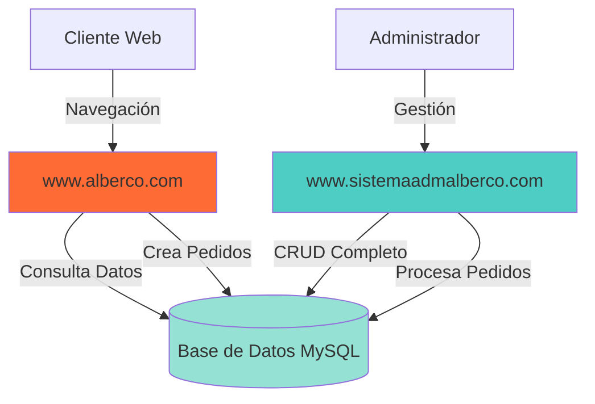
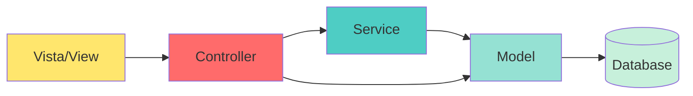
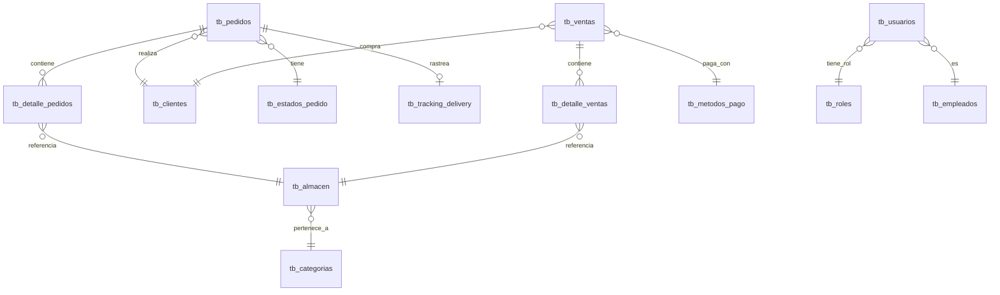
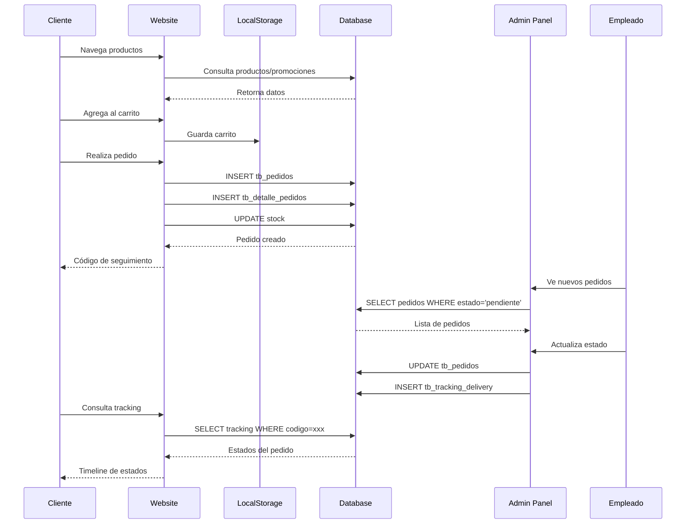
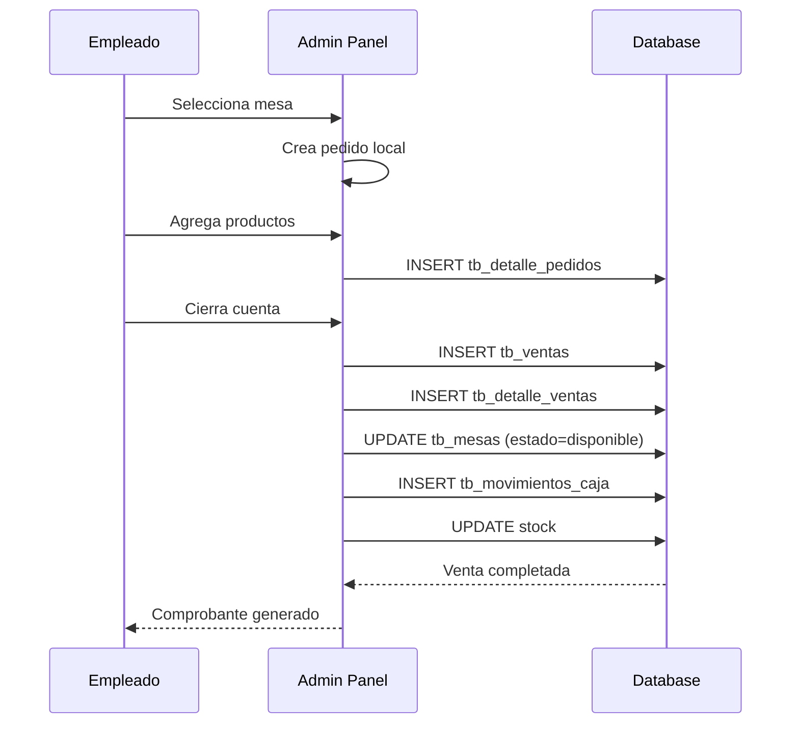

# Arquitectura del Proyecto Alberco

> **Generado:** 2025-12-08  
> **Sistema:** Alberco - Pollería y Chifa Premium

---

## 📋 Índice

- [Visión General](#-visión-general)
- [Proyectos del Ecosistema](#-proyectos-del-ecosistema)
- [Arquitectura Técnica](#-arquitectura-técnica)
- [Stack Tecnológico](#-stack-tecnológico)
- [Estructura de Base de Datos](#-estructura-de-base-de-datos)
- [Flujo de Datos](#-flujo-de-datos)
- [Integración entre Sistemas](#-integración-entre-sistemas)
- [Seguridad y Autenticación](#-seguridad-y-autenticación)

---

## 🎯 Visión General

El proyecto Alberco es un **ecosistema completo de gestión y ventas** para una pollería y chifa, compuesto por dos aplicaciones web principales que comparten la misma base de datos:



---

## 🌐 Proyectos del Ecosistema

### 1. **www.alberco.com** - Sitio Web de Ventas (Frontend Público)

**Propósito:** Sitio web público orientado al cliente para visualizar productos, realizar pedidos y acceso a información.

#### Estructura de Directorios

```
www.alberco.com/
├── .htaccess                    # Configuración Apache (reescritura URLs)
├── index.php                    # Página principal (Hero + Promociones)
├── app/                         # Núcleo de la aplicación
│   ├── init.php                 # Inicialización y bootstrapping
│   └── helpers.php              # Funciones helper globales
├── Assets/                      # Recursos estáticos
│   └── imagenes/                # Imágenes del sitio (logos, fondos)
├── Constans/                    # Constantes y configuraciones
│   ├── css/                     # Estilos CSS personalizados
│   └── js/                      # Scripts JavaScript del sitio
├── Services/                    # Capa de servicios y APIs
│   ├── auth_cliente.php         # Autenticación de clientes
│   ├── configuracion_service.php # Servicio de configuración del sitio
│   ├── direcciones_api.php      # API para manejo de direcciones
│   ├── pedido_api.php           # API para crear/consultar pedidos
│   ├── seguimiento_api.php      # API de tracking de pedidos
│   └── verificar_stock.php      # Verificación de disponibilidad
├── Vista/                       # Vistas (páginas del sitio)
│   ├── menu.php                 # Catálogo de productos
│   ├── promociones.php          # Página de ofertas
│   ├── pedido.php               # Formulario de pedido
│   ├── contacto.php             # Formulario de contacto
│   ├── detalle_producto.php     # Vista individual de producto
│   ├── tracking.php             # Seguimiento de pedidos
│   ├── login_cliente.php        # Login de clientes
│   ├── registro_cliente.php     # Registro de nuevos clientes
│   ├── mi_cuenta.php            # Panel del cliente
│   ├── css/                     # Estilos específicos de vistas
│   └── js/                      # Scripts específicos de vistas
├── includes/                    # Componentes reutilizables
│   ├── header.php               # Encabezado (navbar, meta tags)
│   ├── footer.php               # Pie de página
│   └── countdown.php            # Componente de cuenta regresiva
├── database/                    # Configuración de DB (heredada)
└── docs/                        # Documentación del proyecto
```

#### Características Principales

- ✅ **Diseño Premium Moderno:** UI con gradientes, animaciones AOS, glassmorphism
- ✅ **Sistema de Promociones Dinámicas:** Control desde admin panel
- ✅ **Carrito de Compras:** LocalStorage + Sincronización con BD
- ✅ **Autenticación de Clientes:** Login/Registro con sesiones
- ✅ **Tracking de Pedidos:** Seguimiento en tiempo real
- ✅ **Sistema de Eventos:** Countdown para eventos especiales (Año Nuevo, etc.)
- ✅ **Anuncios Configurables:** Banner hero, cabecera, footer

#### Páginas Clave

| Página | Ruta | Descripción |
|--------|------|-------------|
| Inicio | `index.php` | Hero section, promociones, categorías |
| Menú | `Vista/menu.php` | Catálogo completo con filtros |
| Promociones | `Vista/promociones.php` | Productos en oferta |
| Detalle Producto | `Vista/detalle_producto.php?id=X` | Información completa del producto |
| Pedido | `Vista/pedido.php` | Formulario de pedido (delivery/recojo) |
| Tracking | `Vista/tracking.php` | Rastreo de pedido por código |
| Mi Cuenta | `Vista/mi_cuenta.php` | Panel del cliente (pedidos, direcciones) |
| Contacto | `Vista/contacto.php` | Formulario de contacto |

---

### 2. **www.sistemaadmalberco.com** - Sistema Administrativo (Backend)

**Propósito:** Panel administrativo completo para gestión de restaurante (ventas, inventario, personal, reportes).

#### Estructura de Directorios

```
www.sistemaadmalberco.com/
├── .htaccess                    # Configuración Apache
├── index.php                    # Dashboard principal
├── services/                    # Servicios centrales
│   ├── database/
│   │   └── config.php           # Configuración de BD (PDO)
│   ├── apiservices/             # APIs externas
│   ├── middleware/              # Middleware de autenticación
│   └── sesion/                  # Gestión de sesiones
├── models/                      # Modelos de datos (23 modelos)
│   ├── producto.php             # CRUD de productos
│   ├── categorias.php           # Gestión de categorías
│   ├── pedido.php               # Lógica de pedidos
│   ├── cliente.php              # Gestión de clientes
│   ├── venta.php                # Procesamiento de ventas
│   ├── empleado.php             # Gestión de empleados
│   ├── usuario.php              # Usuarios del sistema
│   ├── rols.php                 # Roles y permisos
│   ├── mesas.php                # Control de mesas
│   ├── compras.php              # Compras a proveedores
│   ├── proveedor.php            # Proveedores
│   ├── arqueocaja.php           # Arqueo de caja
│   ├── movimientodecaja.php     # Movimientos de caja
│   ├── trackingDelivery.php     # Sistema de tracking
│   ├── configuracion_sitio.php  # Configuración del sitio web
│   ├── anuncio.php              # Gestión de anuncios
│   ├── evento.php               # Eventos especiales
│   ├── auditoria.php            # Logs de auditoría
│   ├── database.php             # Clase base de BD
│   └── ... (otros modelos)
├── controllers/                 # Controladores por módulo
│   ├── auth/                    # Autenticación y logout
│   ├── dashboard/               # Dashboard y KPIs
│   ├── productos/               # CRUD de productos (9 archivos)
│   ├── categorias/              # CRUD de categorías
│   ├── venta/                   # Proceso de ventas (6 archivos)
│   ├── pedidos/                 # Gestión de pedidos (5 archivos)
│   ├── clientes/                # Gestión de clientes
│   ├── empleados/               # Gestión de empleados
│   ├── usuario/                 # Gestión de usuarios
│   ├── rol/                     # Gestión de roles
│   ├── mesas/                   # Control de mesas (4 archivos)
│   ├── caja/                    # Arqueo y movimientos (6 archivos)
│   ├── compras/                 # Gestión de compras
│   ├── proveedores/             # CRUD de proveedores
│   ├── tracking/                # Actualización de estados de delivery
│   ├── personalizacion/         # Configuración del sitio web
│   ├── notificaciones/          # Sistema de notificaciones
│   └── logs/                    # Visualización de auditoría
├── views/                       # Vistas del adminpanel (90 archivos)
│   ├── login/                   # Pantalla de login
│   ├── almacen/                 # Vistas de productos/inventario
│   ├── categorias/              # Vistas de categorías
│   ├── venta/                   # Interface de ventas
│   ├── pedidos/                 # Gestión de pedidos
│   ├── clientes/                # Vistas de clientes
│   ├── empleados/               # Gestión de personal
│   ├── usuarios/                # Gestión de usuarios
│   ├── roles/                   # Gestión de roles
│   ├── mesas/                   # Control de mesas
│   ├── caja/                    # Caja y finanzas
│   ├── compras/                 # Interface de compras
│   ├── proveedores/             # Gestión de proveedores
│   ├── reportes/                # Reportes e informes
│   ├── configuracion/           # Configuración general
│   ├── logs/                    # Visualización de logs
│   ├── tracking/                # Panel de tracking
│   └── test/                    # Páginas de testing
├── contans/                     # Constantes y layouts
│   └── layout/
│       ├── parte1.php           # Header del admin (navbar, sidebar)
│       ├── parte2.php           # Footer del admin
│       ├── sesion.php           # Control de sesión
│       └── mensajes.php         # Sistema de mensajes flash
├── helpers/                     # Funciones auxiliares
├── assets/                      # Assets del admin (1988 archivos)
│   ├── imagen/                  # Imágenes del admin panel
│   └── public/                  # Bibliotecas (AdminLTE, plugins)
├── uploads/                     # Archivos subidos
│   ├── productos/               # Fotos de productos
│   ├── categorias/              # Fotos de categorías
│   ├── empleados/               # Fotos de empleados
│   └── almacen/                 # Otros archivos
└── sql/                         # Scripts SQL
```

#### Módulos Principales

| Módulo | Descripción | Controladores | Vistas |
|--------|-------------|---------------|--------|
| **Dashboard** | Panel principal con KPIs | 3 | 1 |
| **Productos/Almacén** | Gestión de inventario | 9 | 7+ |
| **Categorías** | Organización de productos | 9 | 6+ |
| **Ventas** | Procesamiento de ventas | 6 | 8+ |
| **Pedidos** | Gestión de pedidos (web + local) | 5 | 6+ |
| **Clientes** | CRM básico | 6 | 5+ |
| **Empleados** | Gestión de personal | 4-6 | 6+ |
| **Usuarios** | Accesos al sistema | 6 | 5+ |
| **Roles** | Permisos y control de acceso | 6 | 4+ |
| **Mesas** | Control de mesas del local | 4 | 3+ |
| **Caja** | Arqueo y movimientos | 6 | 5+ |
| **Compras** | Compras a proveedores | 5 | 4+ |
| **Proveedores** | Gestión de proveedores | 8 | 6+ |
| **Tracking** | Seguimiento de delivery | 4 | 3+ |
| **Personalización** | Configuración del sitio web | 4 | 4+ |
| **Reportes** | Informes y reportes | - | 3+ |
| **Logs** | Auditoría del sistema | 1 | 2+ |

---

## 🏗️ Arquitectura Técnica

### Patrón de Diseño

Ambos proyectos utilizan un patrón **MVC simplificado con capa de servicios**:



#### Componentes

1. **Vista (View)**
   - Archivos PHP con HTML/CSS/JS
   - Responsables de la presentación
   - Consumen datos de controladores

2. **Controlador (Controller)**
   - Lógica de negocio y flujo de aplicación
   - Validación de entrada
   - Coordinación entre modelos y vistas

3. **Servicio (Service)**
   - Capa de abstracción para operaciones complejas
   - APIs internas y externas
   - Lógica reutilizable

4. **Modelo (Model)**
   - Interacción directa con base de datos
   - Métodos CRUD
   - Validación de datos

### Arquitectura por Proyecto

#### www.alberco.com (Website)

```
Usuario → Vista → Service → Model (Admin) → Database
                     ↓
              LocalStorage (Carrito)
```

**Características:**
- **Sin autenticación obligatoria** para navegación
- **Autenticación opcional** para clientes registrados
- **Acceso de solo lectura** a productos/categorías
- **Acceso de escritura** solo para pedidos/clientes
- **Reutiliza modelos** del sistema admin

#### www.sistemaadmalberco.com (Admin)

```
Usuario → Login → Sesión → Vista → Controller → Model → Database
                    ↓
              Middleware (Permisos)
```

**Características:**
- **Autenticación obligatoria** (usuario/contraseña)
- **Control de permisos** por rol
- **CRUD completo** en todas las entidades
- **Auditoría** de todas las operaciones críticas

---

## 💻 Stack Tecnológico

### Backend

| Tecnología | Versión | Uso |
|------------|---------|-----|
| **PHP** | 7.4+ | Lenguaje principal |
| **MySQL** | 5.7+ / MariaDB | Base de datos |
| **PDO** | - | Abstracción de BD |
| **Apache** | 2.4+ | Servidor web (XAMPP) |

### Frontend

#### www.alberco.com
| Tecnología | Propósito |
|------------|-----------|
| **HTML5** | Estructura |
| **CSS3** | Estilos (custom + variables CSS) |
| **JavaScript Vanilla** | Interactividad |
| **AOS.js** | Animaciones on scroll |
| **Font Awesome** | Iconografía |
| **Google Fonts** | Tipografía premium |

#### www.sistemaadmalberco.com
| Tecnología | Propósito |
|------------|-----------|
| **AdminLTE 3** | Template administrativo |
| **Bootstrap 4** | Framework CSS responsive |
| **jQuery** | Manipulación DOM |
| **DataTables** | Tablas interactivas |
| **Chart.js** | Gráficos y reportes |
| **Select2** | Selectores mejorados |
| **Toastr** | Notificaciones |

### Almacenamiento

| Tipo | Uso |
|------|-----|
| **MySQL** | Datos persistentes |
| **LocalStorage** | Carrito de compras (website) |
| **Sesiones PHP** | Autenticación y datos temporales |
| **File System** | Uploads de imágenes |

---

## 🗄️ Estructura de Base de Datos

### Tablas Principales

La base de datos es **compartida** entre ambos sistemas:

#### Productos y Categorías
- `tb_almacen` - Productos/inventario
- `tb_categorias` - Categorías de productos

#### Ventas y Pedidos
- `tb_ventas` - Ventas realizadas
- `tb_detalle_ventas` - Items de cada venta
- `tb_pedidos` - Pedidos (web + local)
- `tb_detalle_pedidos` - Items de pedidos
- `tb_estados_pedido` - Estados del workflow
- `tb_tracking_delivery` - Seguimiento de delivery

#### Clientes
- `tb_clientes` - Clientes del sistema
- `tb_direcciones_cliente` - Direcciones de entrega

#### Administración
- `tb_usuarios` - Usuarios del admin
- `tb_roles` - Roles de usuarios
- `tb_empleados` - Personal del restaurante

#### Inventario y Compras
- `tb_compras` - Compras a proveedores
- `tb_proveedores` - Proveedores

#### Restaurant Management
- `tb_mesas` - Mesas del local
- `tb_caja` - Arqueos de caja
- `tb_movimientos_caja` - Movimientos de caja
- `tb_metodos_pago` - Métodos de pago
- `tb_tipos_comprobante` - Tipos de comprobante

#### Configuración del Sitio
- `tb_configuracion_sitio` - Ajustes generales del website
- `tb_anuncios` - Anuncios y banners
- `tb_eventos` - Eventos especiales con countdown

#### Auditoría
- `tb_auditoria` - Logs de todas las operaciones
- `tb_notificaciones` - Notificaciones del sistema

### Relaciones Clave



---

## 🔄 Flujo de Datos

### Flujo de Pedido (E2E)



### Flujo de Venta en Local



---

## 🔗 Integración entre Sistemas

### Punto de Integración: `app/init.php`

El archivo `app/init.php` en el website **importa componentes del sistema admin**:

```php
// Define Admin System Path
define('ADMIN_PATH', __DIR__ . '/../../www.sistemaadmalberco.com/');

// Include Admin Configuration and Database
require_once ADMIN_PATH . 'services/database/config.php';
require_once ADMIN_PATH . 'models/database.php';

// Include Models (read-only access)
require_once ADMIN_PATH . 'models/producto.php';
require_once ADMIN_PATH . 'models/categorias.php';
require_once ADMIN_PATH . 'models/pedido.php';
require_once ADMIN_PATH . 'models/cliente.php';
```

### Ventajas de esta Arquitectura

✅ **DRY (Don't Repeat Yourself):** No duplicar código de modelos  
✅ **Single Source of Truth:** Un solo punto de acceso a datos  
✅ **Mantenibilidad:** Cambios en modelos afectan ambos sistemas  
✅ **Consistencia:** Misma lógica de validación  

### Desventajas / Consideraciones

⚠️ **Acoplamiento:** Website depende del admin  
⚠️ **Rutas relativas:** Cambios en estructura de carpetas afectan  
⚠️ **Seguridad:** Website tiene acceso a modelos del admin (pero sin autenticación)  

---

## 🔐 Seguridad y Autenticación

### Sistema Administrativo

#### Autenticación
- **Método:** Sesiones PHP
- **Credenciales:** Usuario/contraseña hasheada
- **Persistencia:** `$_SESSION['sesion_usuario']`
- **Timeout:** Configurable

#### Control de Acceso
```php
// contans/layout/sesion.php
if (!isset($_SESSION['sesion_usuario'])) {
    header('Location: ' . URL_BASE . '/views/login');
    exit();
}
```

#### Roles y Permisos
- Tabla: `tb_roles`
- Asignación: `tb_usuarios.id_rol`
- **Roles comunes:**
  - Administrador (acceso total)
  - Cajero (ventas + caja)
  - Mesero (pedidos + mesas)
  - Cocinero (pedidos pendientes)

### Website Público

#### Autenticación de Clientes
- **Método:** Sesiones PHP + `tb_clientes`
- **Login:** `Services/auth_cliente.php`
- **Registro:** `Vista/registro_cliente.php`
- **Opcional:** Solo para historial de pedidos y direcciones guardadas

#### Seguridad en Pedidos
- Validación de stock antes de confirmar
- Sanitización de inputs
- Protección CSRF (limitada)

---

## 📊 Características Destacadas

### Sistema de Promociones
- Control desde admin panel
- Fechas de inicio/fin
- Descuentos porcentuales o fijos
- Visualización automática en website

### Sistema de Eventos
- Countdown dinámico
- Personalización de colores/estilos
- Mensajes antes/durante/después del evento
- Ejemplo: Evento Año Nuevo 2025

### Sistema de Anuncios
- **Posiciones:** hero, cabecera, footer
- **Tipos:** alerta, info, promoción, evento
- **Estilos:** CSS personalizable via JSON

### Tracking de Pedidos
- Estados configurables
- Timeline visual
- Notificaciones automáticas
- Código de seguimiento único

### Reportes y Auditoría
- Reportes de ventas por período
- Productos más vendidos
- Movimientos de caja
- Logs de auditoría completos

---

## 🎨 Diseño UI/UX

### Website (www.alberco.com)
- **Estilo:** Moderno, premium, gradientes vibrantes
- **Colores:** Naranja (#FF3D00) + Degradados dinámicos
- **Animaciones:** AOS (Animate On Scroll)
- **Responsive:** Mobile-first
- **Tipografía:** Google Fonts (Inter, Outfit)

### Admin Panel (www.sistemaadmalberco.com)
- **Template:** AdminLTE 3
- **Estilo:** Profesional, funcional
- **Colores:** Azul corporativo + naranja (brand)
- **Componentes:** DataTables, Chart.js, Select2
- **Responsive:** Sidebar colapsable

---

## 📈 Escalabilidad

### Consideraciones Actuales
- **Arquitectura monolítica:** Todo en un servidor
- **Base de datos única:** MySQL compartida
- **Sin caché:** Consultas directas a BD
- **Sin APIs REST formales:** Comunicación directa

### Mejoras Sugeridas para Escalabilidad
1. **Separar frontend y backend:** REST API
2. **Implementar caché:** Redis/Memcached
3. **CDN para assets:** Imágenes y archivos estáticos
4. **Optimización de BD:** Índices, vistas materializadas
5. **Queue system:** Para procesamiento asíncrono (emails, notificaciones)
6. **Microservicios:** Separar tracking, reportes, notificaciones

---

## 🛠️ Mantenimiento y Deployment

### Entorno de Desarrollo
- **Servidor:** XAMPP (Apache + MySQL + PHP)
- **Path:** `c:\xampp\htdocs\`
- **Base de datos:** Local MySQL

### Entorno de Producción
- **Dominio:** allwiya.pe (según conversaciones previas)
- **Hosting:** cPanel/Hosting compartido
- **Base de datos:** MySQL remoto
- **Ajustes:** Configurar `URL_BASE` en config.php

### Backup Strategy
1. **Base de datos:** Exportar SQL regularmente
2. **Archivos uploads:** Respaldo de `/uploads`
3. **Código:** Control de versiones (Git recomendado)

---

## 📞 Puntos de Entrada (URLs)

### Website Público
- `http://localhost/www.alberco.com/` → Página principal
- `http://localhost/www.alberco.com/Vista/menu.php` → Catálogo
- `http://localhost/www.alberco.com/Vista/pedido.php` → Realizar pedido
- `http://localhost/www.alberco.com/Vista/tracking.php` → Seguimiento
- `http://localhost/www.alberco.com/Vista/mi_cuenta.php` → Panel cliente

### Sistema Administrativo
- `http://localhost/www.sistemaadmalberco.com/` → Dashboard
- `http://localhost/www.sistemaadmalberco.com/views/login/` → Login
- `http://localhost/www.sistemaadmalberco.com/views/almacen/` → Productos
- `http://localhost/www.sistemaadmalberco.com/views/venta/` → Punto de venta
- `http://localhost/www.sistemaadmalberco.com/views/pedidos/` → Gestión pedidos
- `http://localhost/www.sistemaadmalberco.com/views/reportes/` → Reportes

---

## 🎯 Conclusión

El ecosistema Alberco es una solución completa que integra:
- ✅ **Frontend moderno** para clientes
- ✅ **Backend robusto** para administración
- ✅ **Base de datos compartida** para consistencia
- ✅ **Gestión completa** de restaurante (ventas, inventario, personal, reportes)
- ✅ **Sistema de pedidos online** con tracking
- ✅ **Panel de personalización** para el sitio web

Esta arquitectura permite **gestionar todo el negocio** desde una única plataforma integrada.

---

> **Nota:** Este documento refleja la arquitectura actual del proyecto. Para cambios futuros, consultar con el equipo de desarrollo.
